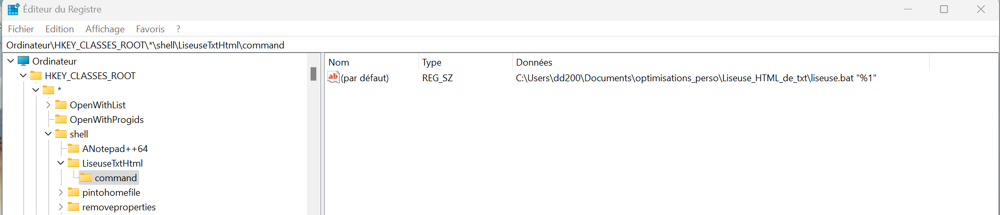

# 🚀 Windows Optimization Toolkit

[](https://opensource.org/licenses/MIT)
[](https://github.com/3C0D/Windows-Optimization-Toolkit)

A collection of scripts and tools to enhance your Windows experience with productivity shortcuts, text-to-speech capabilities, translation tools, and more.

## 📋 Table of Contents

- [Overview](#overview)
- [Prerequisites](#prerequisites)
- [AutoHotkey Scripts](#-autohotkey-scripts)
  - [Shortcuts Viewer](#shortcuts-viewer)
  - [Text-to-Speech](#text-to-speech-tts)
  - [Translate in Browser](#translate-in-browser)
  - [Personal Shortcuts](#personal-shortcuts)
- [Audio Video Download](#-audio-video-download)
- [Contributing](#contributing)
- [License](#license)

## Overview

This toolkit provides various utilities to optimize your Windows workflow, including:

- Keyboard shortcuts for common tasks
- Text-to-speech functionality
- Translation tools
- Video and audio download capabilities

## Prerequisites

- Windows 10/11
- [AutoHotkey v2.0](https://www.autohotkey.com/) for AHK scripts
- [Python 3.8+](https://www.python.org/downloads/) for Python scripts

## 🤖 AutoHotkey Scripts

Important: All scripts are run from `shortcutsViewer.ahk`

### Shortcuts Viewer

> **Shortcut:** <kbd>Win</kbd>+<kbd>Shift</kbd>+<kbd>/</kbd> - Opens the shortcuts viewer window

The Shortcuts Viewer allows you to manage all your custom keyboard shortcuts in one place. You can add, edit, and organize shortcuts by category. Changes are automatically saved when you close the window.

**Key Features:**
- Centralized management of all shortcuts
- Category-based organization
- Automatic saving of changes
- Easy to use interface

**Installation:**

You only need to load the main file: `AutoHotkey\Shortcuts viewer\shortcutsViewer.ahk`. All other scripts are automatically included from this file.

```ahk
#Include Personal_shortcuts/personalShortcuts.ahk
#Include Translate_in_browser/translateInBrowser.ahk
#Include TTS/TTS.ahk
```


### Text-to-Speech (TTS)

Convert any text to speech with a comprehensive set of keyboard shortcuts. The system supports both Microsoft voices and OpenAI's text-to-speech API.

#### Keyboard Shortcuts

| Shortcut | Function |
|----------|----------|
| <kbd>Win</kbd>+<kbd>Y</kbd> | Start/Stop TTS on selected text or clipboard content |
| <kbd>Win</kbd>+<kbd>Alt</kbd>+<kbd>Y</kbd> | Pause/Resume reading |
| <kbd>Win</kbd>+<kbd>Ctrl</kbd>+<kbd>Y</kbd> | Jump to next line |
| <kbd>Win</kbd>+<kbd>Shift</kbd>+<kbd>Y</kbd> | Jump to previous paragraph |
| <kbd>Numpad</kbd> <kbd>+</kbd>/<kbd>-</kbd> | Increase/Decrease reading speed |
| <kbd>Numpad</kbd> <kbd>*</kbd> | Increase volume |
| <kbd>Numpad</kbd> <kbd>/</kbd> | Decrease volume |

> **Note:** The script automatically registers missing voices in the Windows registry. For example, Microsoft Paul (French) is registered by the script even though it's not registered by default in Windows.

To view all installed voices, run: `AutoHotkey\Shortcuts viewer\TTS\seeInstalledVoices.ahk`

#### OpenAI TTS Integration

The TTS functionality also includes integration with OpenAI's text-to-speech API, offering high-quality voice synthesis.

**Features:**

- **Multiple Voice Options:** Alloy, Echo, Fable, Onyx, Nova, Shimmer
- **Advanced Controls:** Play, pause, resume, stop
- **Smart Language Detection:** Automatically detects text language
- **Customizable Settings:** Adjust volume, rate, and pitch
- **Content Support:** Reads various content types including frontmatter, links, and code blocks

**Setup:**

1. Configure your OpenAI API key in the plugin settings
2. Select your preferred voice from the available options
3. Use the TTS commands or menu options to start playback

### Translate in Browser

> **Shortcut:** <kbd>Ctrl</kbd>+<kbd>Win</kbd>+<kbd>T</kbd> - Translate selected text or clipboard content

This utility allows you to quickly translate any text from anywhere in Windows. Simply select text or copy it to your clipboard, then press the shortcut to open Google Translate in your default browser with the text already loaded.

**Features:**
- Works from any application
- Uses Google Translate for accurate translations
- Preserves formatting when possible
- Automatically detects source language

### Personal Shortcuts

> **Shortcut:** <kbd>Win</kbd>+<kbd>Shift</kbd>+<kbd>G</kbd> - Search Google for selected text

Quickly search Google for any selected text or clipboard content without manually opening a browser and typing the query.

## 📶 Toggle_WIFI

A simple utility to quickly toggle your WiFi connection on and off or restart it when needed.

**Usage:**
1. Run `Toggle_WIFI\exe ps1.bat`
2. For easier access, create a shortcut on your desktop

**Why it's useful:**
- Quickly fix connection issues without navigating through Windows settings
- Toggle WiFi on/off with a single click
- Restart your connection when it drops unexpectedly

## 🎥 Transcription_Python

> **Note: Ce module est conservé pour des raisons d'archivage et n'est plus activement utilisé.**

Transcribe videos from Odysee and YouTube into text in both English and French using OpenAI's Whisper speech recognition model.

### Features

- **Video Download:** Download videos from Odysee and YouTube
- **Automatic Transcription:** Convert speech to text with high accuracy
- **Multi-language Support:** Transcribe in English and French
- **Customizable Models:** Choose from different Whisper models based on your hardware

### Getting Started

1. Install FFmpeg in C:\ and add it to your environment variables
2. Copy a video link to your clipboard
3. Run `Transcription_Python\transcritption_files\transcript.bat`
4. The transcription will be saved as a text file in the `Transcription_Python` folder

> **Tip:** For faster access, you can run the batch file from a launcher like Flow Launcher with a custom shortcut.

### Available Models

| Model | Size | RAM Required | Use Case |
|-------|------|-------------|----------|
| Tiny | ~39 MB | ~1 GB | Basic transcription, limited resources |
| Base | ~74 MB | ~1.5 GB | Better accuracy, still lightweight |
| Small | ~244 MB | ~2.8 GB | Good balance (default in script) |
| Medium | ~769 MB | ~5.5 GB | High accuracy, requires more RAM |
| Large | ~1.55 GB | ~10 GB | Best accuracy, requires GPU |

**Changing Models:** Edit `transcription_script.py` and replace `whisper.load_model("small")` with your preferred model size.

### Video Download

The toolkit now includes a dedicated video downloader for Odysee and YouTube. To use it:

1. Run `download_video.bat`
2. Set your target download path in `download_video.py`

### Language Detection and Translation

The transcription system includes advanced language processing capabilities:

- **Automatic Language Detection:** Identifies the source language of transcribed content
- **Translation Engine:** Translates between languages (primarily English and French)
- **Smart Text Processing:** Handles large texts by splitting into manageable chunks
- **Preservation of Formatting:** Maintains text structure during translation

All transcription output is saved as `.txt` files in the `Transcription_Python` folder. For a more readable experience, use the HTML Text Reader described below.

## 📥 Audio Video Download

Un outil puissant pour télécharger des vidéos et de l'audio depuis YouTube, Odysee et d'autres sites web.

### Fonctionnalités

- **Téléchargement de vidéos YouTube** avec choix de qualité (jusqu'à 1080p)
- **Extraction audio en MP3** avec différentes qualités (192, 128, 96 kbps)
- **Support pour Odysee** et autres plateformes vidéo
- **Installation automatique** des dépendances et mises à jour
- **Exportation automatique des cookies** depuis Chrome pour accéder aux contenus restreints

### Utilisation

1. Copiez l'URL de la vidéo dans le presse-papier
2. Exécutez `Transcription_python\video_audio_download\video_audio_download.bat`
3. Choisissez le type de téléchargement (vidéo ou audio)
4. Sélectionnez la qualité souhaitée
5. Le fichier sera téléchargé dans le dossier approprié et l'explorateur s'ouvrira automatiquement

### Installation

Aucune installation manuelle n'est nécessaire. Le script gère automatiquement :
- La création d'un environnement virtuel Python
- L'installation des modules requis (yt-dlp, pyperclip, etc.)
- La mise à jour de yt-dlp
- L'exportation des cookies depuis Chrome

> **Astuce :** Créez un raccourci sur votre bureau pour un accès rapide à l'outil.

Pour plus de détails, consultez le [README dédié](Transcription_python/video_audio_download/README.md) de cet outil.

## 📖 HTML Text Reader

A browser-based text file reader that enhances the readability of transcription outputs and other text files.

### Features

- **Enhanced Readability:** Clean, modern interface for reading text files
- **Browser Integration:** Use browser extensions for additional functionality
- **Copy Functionality:** Easily copy text to clipboard
- **File Selection:** Open any text file through a simple interface

### Installation Options

#### Method 1: Standalone Use

Simply copy the HTML file to any location and double-click to open. Then select the text file you want to read.

#### Method 2: Windows Context Menu Integration

Add the reader to your Windows context menu for quick access from any file.



**Steps to add to Windows context menu:**

1. **Open Registry Editor**
   - Press <kbd>Win</kbd>+<kbd>R</kbd>, type `regedit` and press Enter

2. **Navigate to Shell Key**
   - Go to `HKEY_CLASSES_ROOT\*\shell`

3. **Create New Key**
   - Right-click on `shell` and select New > Key
   - Name it `LiseuseTxtHtml` (or your preferred name)

4. **Add Command Key**
   - Right-click on your new key and select New > Key
   - Name it `command`

5. **Set Command Path**
   - Edit the Default value of the command key
   - Enter: `C:\Users\<username>\Documents\optimisations_perso\Liseuse_HTML_de_txt\liseuse.bat "%1"`

6. **Test the Integration**
   - Right-click any text file
   - Select your new context menu option

> **Note:** Registry modifications require administrator privileges

## Contributing

Contributions to the Windows Optimization Toolkit are welcome! Here's how you can contribute:

1. **Fork the repository**
2. **Create a feature branch**
   ```
   git checkout -b feature/amazing-feature
   ```
3. **Commit your changes**
   ```
   git commit -m 'Add some amazing feature'
   ```
4. **Push to the branch**
   ```
   git push origin feature/amazing-feature
   ```
5. **Open a Pull Request**

Please make sure to update tests as appropriate and follow the coding style of the project.

## License

This project is licensed under the MIT License - see the [LICENSE](LICENSE) file for details.

---

<p align="center">
Made with ❤️ by <a href="https://github.com/3C0D">3C0D</a>
</p>
